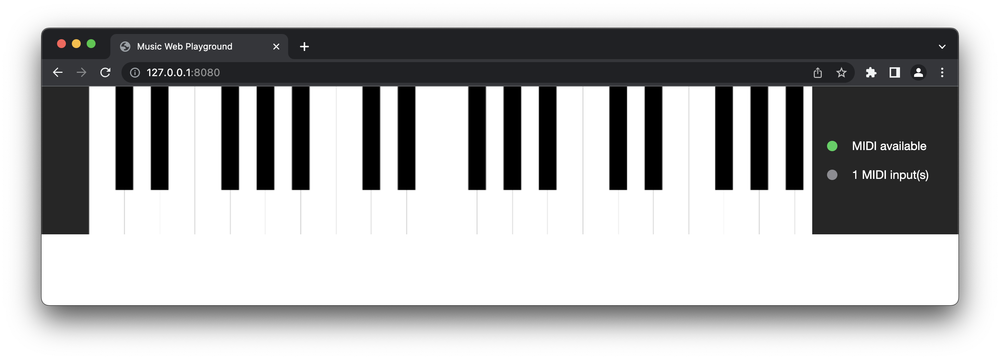

# Swift Music Web Playground

A small demo of [`swift-music-theory`](https://github.com/fwcd/swift-music-theory) in a [SwiftWasm](https://github.com/swiftwasm) + [Tokamak](https://github.com/TokamakUI/Tokamak) web app.



Notes can either be played by clicking with the mouse or via a connected MIDI keyboard (the latter requires a browser that implements the Web MIDI API, e.g. a Chromium-based browser).

## Getting Started

Make sure to have [Canton](https://github.com/swiftwasm/carton) installed. To start the development server that continuously rebuilds the app, run

```sh
carton dev
```

To bundle the app for production, run

```sh
carton bundle
```
