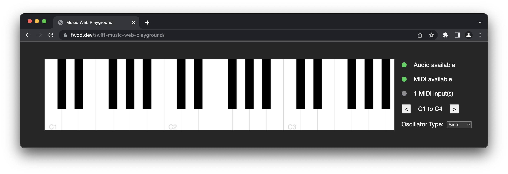

# Swift Music Web Playground

[](https://github.com/fwcd/swift-music-web-playground/actions/workflows/deploy.yml)

A small demo of [`swift-music-theory`](https://github.com/fwcd/swift-music-theory) in a [SwiftWasm](https://github.com/swiftwasm) + [Tokamak](https://github.com/TokamakUI/Tokamak) web app. [Try it out on the web here!](https://fwcd.github.io/swift-music-web-playground)



Notes can either be played by clicking with the mouse or via a connected MIDI keyboard (the latter requires a browser that implements the Web MIDI API, see [below](#supported-browsers)).

## Getting Started

Make sure to have [Carton](https://github.com/swiftwasm/carton) installed. To start the development server that continuously rebuilds the app, run

```sh
carton dev
```

To bundle the app for production, run

```sh
carton bundle
```

## Supported Browsers

The base functionality requires a browser that supports HTML5, Canvas and [Web Audio](https://developer.mozilla.org/en-US/docs/Web/API/Web_Audio_API), which all modern browsers should provide.

Playing notes with a MIDI controller (e.g. an external MIDI keyboard) requires support for [Web MIDI](https://developer.mozilla.org/en-US/docs/Web/API/Web_MIDI_API), which is not as widely supported yet. Browsers compatible at the time of writing (August 2022) include:

- Chromium-based browsers (e.g. Chrome)
- Firefox Nightly (version 105 or newer) with the following flags:
  - `dom.webmidi.enabled` set to `true`
  - `dom.webmidi.gated` set to `false`
